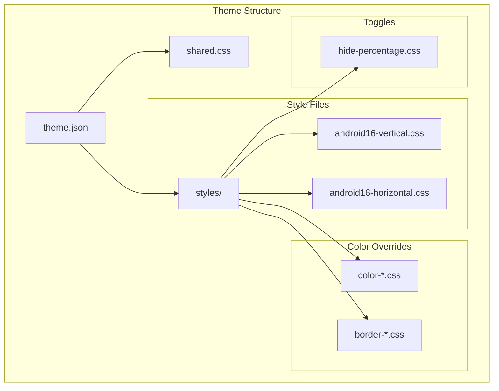
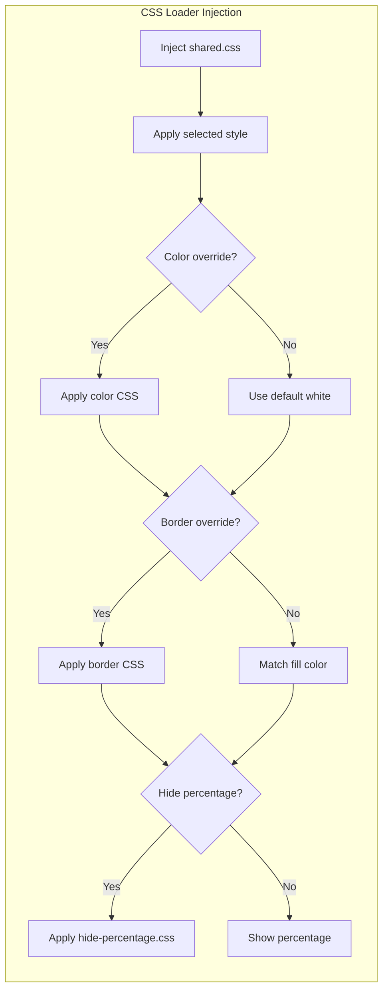
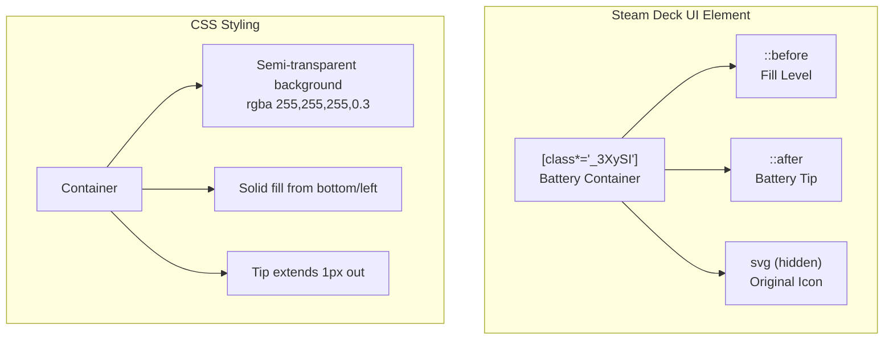
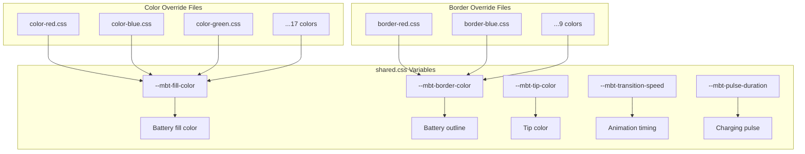
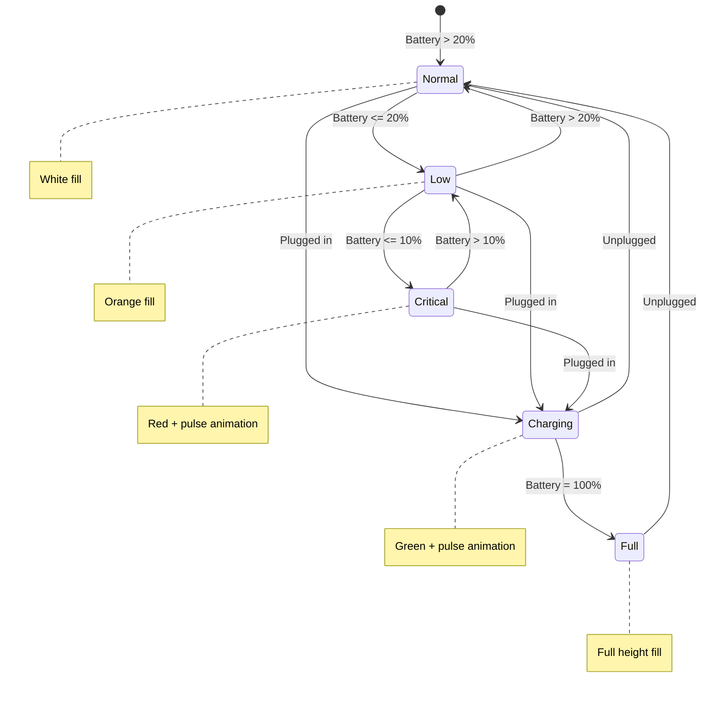
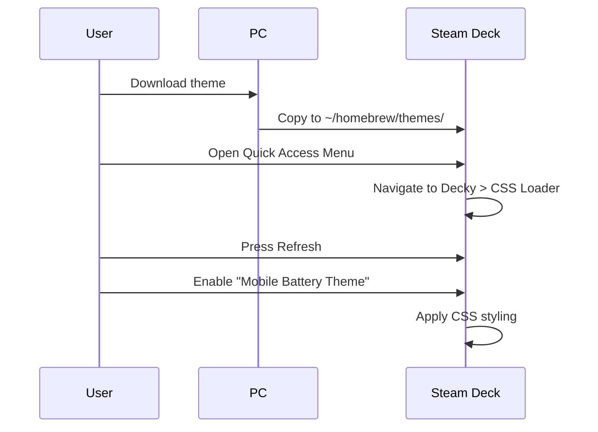

# Mobile Battery Theme

A CSS Loader theme for Steam Deck that replaces the default battery icon with an Android 16 Material You style battery indicator.


```
Android 16 Vertical:        Android 16 Horizontal:
    ╭─╮                     ╭──────────────╮
  ╭─┴─╮                     │ ████████░░░░ ├╮
  │███│                     ╰──────────────╯╯
  │███│
  │░░░│
  ╰───╯
```

## Features

- **2 Battery Orientations**: Vertical and Horizontal layouts
- **17 Fill Colors**: White, Red, Orange, Amber, Yellow, Lime, Green, Emerald, Teal, Cyan, Sky, Blue, Indigo, Violet, Purple, Magenta, Pink, Rose
- **9 Border Colors**: Separate border color customization
- **Percentage Toggle**: Show or hide battery percentage text
- **Battery Level Display**: Shows current charge with semi-transparent depleted portion
- **State Indicators**: Low battery, critical, charging, and full states with animations

## Architecture



## How It Works



## Battery Element Structure



## CSS Variable System



## State Transitions



## Requirements

- Steam Deck with SteamOS
- [Decky Loader](https://github.com/SteamDeckHomebrew/decky-loader) installed
- [CSS Loader](https://github.com/DeckThemes/SDH-CssLoader) plugin installed

## Installation

### From DeckThemes Store (Recommended)
1. Open Quick Access Menu (... button) in Gaming Mode
2. Navigate to Decky > CSS Loader
3. Go to the Store tab
4. Search for "Mobile Battery Theme"
5. Click Install

### Manual Install



1. Copy the `mobile-battery-theme` folder to:
   ```
   /home/deck/homebrew/themes/
   ```
2. In Gaming Mode, open Quick Access Menu
3. Navigate to Decky > CSS Loader
4. Press "Refresh" at the bottom
5. Enable "Mobile Battery Theme"

## Configuration

After enabling the theme, use the dropdown options in CSS Loader to customize:

| Option | Values | Description |
|--------|--------|-------------|
| Battery Style | Vertical, Horizontal | Orientation of battery icon |
| Fill Color | 17 colors | Color of the battery fill |
| Border Color | 9 colors | Color of the battery outline |
| Show Percentage | Yes, No | Toggle percentage text |

## File Structure

```
mobile-battery-theme/
├── theme.json              # Theme manifest with patches
├── shared.css              # CSS variables and animations
└── styles/
    ├── android16-vertical.css    # Vertical battery style
    ├── android16-horizontal.css  # Horizontal battery style
    ├── color-red.css             # Fill color overrides
    ├── color-orange.css
    ├── color-amber.css
    ├── color-yellow.css
    ├── color-lime.css
    ├── color-green.css
    ├── color-emerald.css
    ├── color-teal.css
    ├── color-cyan.css
    ├── color-sky.css
    ├── color-blue.css
    ├── color-indigo.css
    ├── color-violet.css
    ├── color-purple.css
    ├── color-magenta.css
    ├── color-pink.css
    ├── color-rose.css
    ├── border-red.css            # Border color overrides
    ├── border-orange.css
    ├── border-yellow.css
    ├── border-green.css
    ├── border-cyan.css
    ├── border-blue.css
    ├── border-purple.css
    ├── border-pink.css
    ├── border-white.css
    └── hide-percentage.css       # Toggle percentage visibility
```

## Customization

### Creating Custom Colors

Create a new file `styles/color-custom.css`:

```css
:root {
    --mbt-fill-color: #YOUR_HEX !important;
}
```

Then add to `theme.json` under "Fill Color" > "values":

```json
"Custom": { "styles/color-custom.css": ["SP", "QuickAccess", "MainMenu"] }
```

## Troubleshooting

| Issue | Solution |
|-------|----------|
| Theme not appearing | Verify theme.json is valid JSON, refresh CSS Loader |
| Battery unchanged | Check if CSS Loader is enabled and theme is active |
| Colors not applying | Ensure color CSS loads after main style CSS |
| Percentage won't hide | Toggle the option off and refresh |

## License

MIT License - Feel free to modify and redistribute.

## Credits

- [Decky Loader](https://decky.xyz/)
- [DeckThemes/CSS Loader](https://deckthemes.com/)
- Inspired by Android 16 Material You battery design
